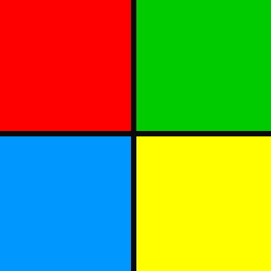
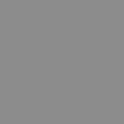
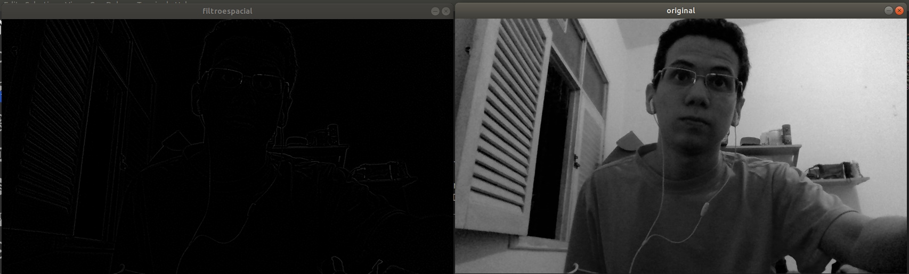
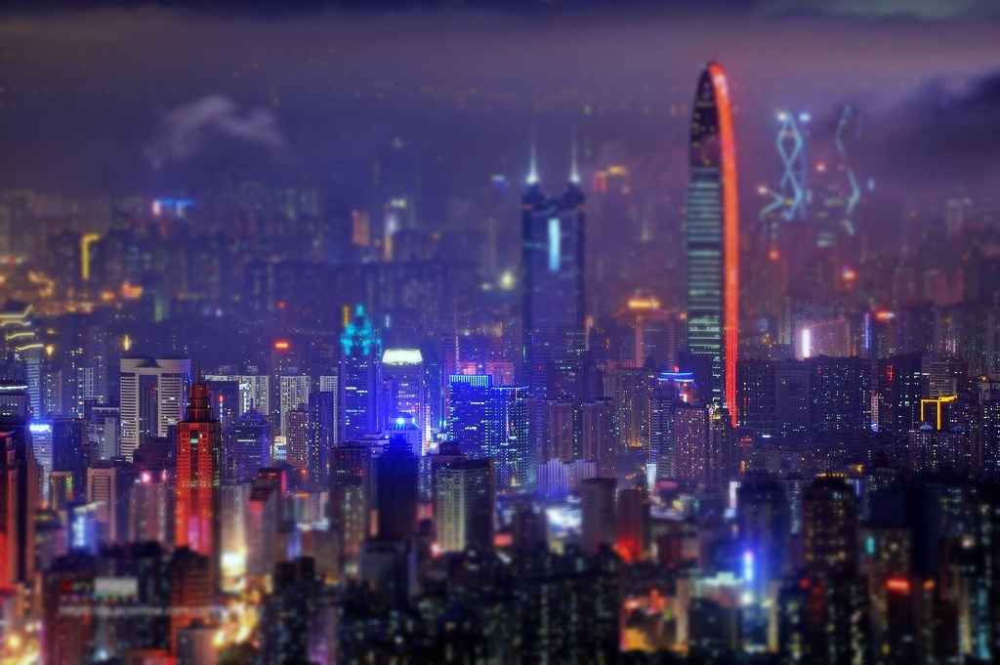
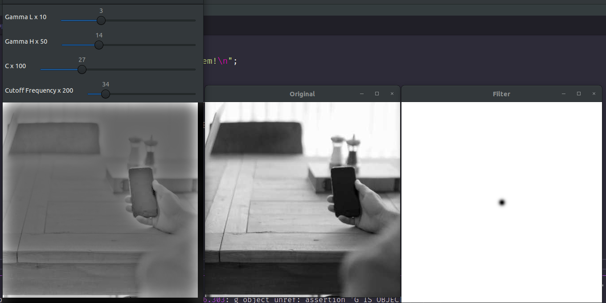
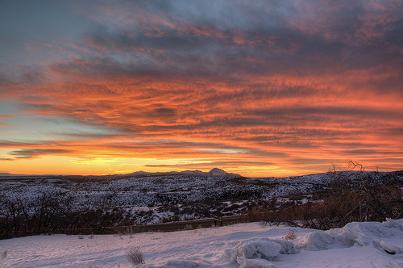
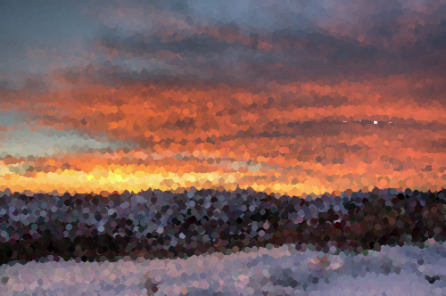

:source-highlighter: pygments
:toc: left
:stem:
:listing-caption: Listing
:icons: font

= Processamento Digital de Imagens

Angelo Marcelino Cordeiro

amc.marcelino.cordeiro@gmail.com

Página desenvolvida como decumentação para os projetos desenvolvidos durante a disciplina DCA0445 - PROCESSAMENTO DIGITAL DE IMAGENS.

Link para o tutorial de opencv: https://agostinhobritojr.github.io/tutorial/pdi/[Introdução ao processamento digital de imagens com OpenCV^].

== 1. Primeira unidade

Neste tópico estão descritos as atividades realizadas referentes a primeira unidade da disciplina DCA0445.
Para a compilação dos códigos referentes à esta unidade, é necessário possuir, no mesmo diretório do arquivo `_.cpp_` o arquivo link:../atividades/Makefile[Makefile^], e executar os seguintes comandos no seu console:

._Makefile_
[source, shell]
----
$ make <nome_arquivo>
$ ./<nome_arquivo> <caminho_para_imagem>
----

=== 1.1. Regiões

Este código tem a função de um programa que recebe do usuário dois pontos P1 e P2 e verifica se os pontos fornecidos estão dentro da imagem. Em seguida delimita-se a região definida pelo retângulo de vértices opostos definidos pelos pontos P1 e P2 na qual é exibido o negativo da imagem efeito esse alcançado subtraindo 255 do valor de cada pixel que compõe o retângulo. 

O código fonte link:../atividades/regions.cpp[regions.cpp^] está está descrito abaixo:

[source, c++]
._regions.cpp_
----
include::../atividades/regions.cpp[]
----

A seguir estão as imagens de entrada do código acima:

.Entrada do programa
[#entrada-regions]
image::../atividades/imgs/person-smartphone-office-table.jpeg[Entrada do programa,300,200,role="left"] 
.Conversão para grayscale
[#grayscale-regions]
image::../atividades/imgs/grayscale.png[Converção tom de cinza,300,200,role="center"]

.

.Negativo com RGB
[#negativo-rgb-regions]

.Negativo do grayscale
[#negativo-grayscale-regions]
image::../atividades/imgs/negativo_grayscale.png[Negativo de grayscale,300,200]

.

=== 1.2. Trocar Regiões

A atividade propõe a construção de um programa que recebe uma imagem, determina e troca os quadrantes diagonalmente numa imagem de saída. Para resolver este problema foi seguido o seguinte algoritmo:

* Obtêm-se os quadrantes da imagem defindo o tamanho da _grid_ como metade da 
altura e largura da imagem, e utilizando o construtor da classe `_Rect_`, seleciona um retângulo da matriz igual ao quadrante selecionado.
* Com o construtor da classe `_Mat_`, copia-se cada quadrante para uma matriz separada. 
* Por fim, concatenam-se os quadrantes utilizando as funções `_vconcat()_` e `_hconcat()_` na imagem, como descreve o código link:../atividades/trocaregioes.cpp[trocaregioes.cpp^] abaixo:

[source, c++]
._trocaregioes.cpp_
----
include::../atividades/trocaregioes.cpp[]
----

A seguir estão exemplos de imagens de entrada e saída do código acima:

.Entrada do programa
[#entrada-trocaregioes]
 

.Saída com regiões trocadas
[#saida-trocaregioes]

.

=== 1.3. Preenchendo Regiões

Este algoritmo tem a função de contar as bolhas que possuem buracos e as que não possuem buracos, eliminando as que tocam as bordas.

.Entrada do programa
[#entrada-rotulacao]
image::../atividades/imgs/bolhas.png[Entrada do programa]

Primeiramente, a exclusão dos objetos que tocam as bordas foi realizada percorrendo-se as primeiras e últimas linhas e colunas da imagem a procura de objetos e, em seguida, preecehendo-os com o valor de fundo usando a função `_floodFill()_`.

.Entrada sem objetos de borda
[#semborda-rotulacao]
image::../atividades/imgs/bolhas_borda.png[Entrada sem borda]

Assim, pega-se o ponto (0.0) da imagem e aplica o algoritmo _floodfill_ neste ponto com a cor de _background_ que será utilizada para preencher todo o fundo da imagem. Como é suposto que os objetos são aréas com cor em _grayscale_ de 255 e os buracos são da mesma cor do fundo antigo, 0, resta então contabilizar quantos objetos existem e quantos deles possuem buracos, seguindo o algoritmo descrito abaixo:

* Caso encotre um buraco com um objeto associado, contabilize o objeto com buraco e preencha o objeto com a nova cor de fundo, por fim, preecher o buraco achado com a cor de fundo.
* Caso encontre um buraco sem objeto associado, preencha-o com a nova cor de fundo.
* Por fim, contabilize os objetos restantes, preenchendo-os com a cor de fundo.

Este processo pode ser visualizado nas figuras abaixo:

.Imagem com novo fundo
[#semfundo-rotulacao]

.Imagem sem buracos
[#semburacos-rotulacao]

.Saida do programa
[#saida-rotulacao]

.

O código implementado, link:../atividades/rotulacao.cpp[rotulacao.cpp^], juntamente da execução do programa estão apresentados abaixo: 

[source, shell]
.Execução do programa
----
$ make rotulacao
$ ./rotulacao bolhas.png
nholes = 7
nobjects = 14
----

[source, c++]
.rotulacao.cpp
----
include::../atividades/rotulacao.cpp[]
----

=== 1.4. Equalização de Histogramas

"Um histograma é uma contagem de dados onde se organiza as ocorrências por faixas de valores predefinidos. Em se tratando de imagens digitais em tons de cinza, por exemplo, costuma-se associar um histograma com a contagem de ocorrências de cada um dos possíveis tons em uma imagem. A grosso modo, o histograma oferece uma estimativa da probabilidade de ocorrência dos tons de cinza na imagem."footnote:[Texto original do site https://agostinhobritojr.github.io/tutorial/pdi/[Introdução ao processamento digital de imagens com OpenCV^]]

O que a equalização de um histograma faz é, basicamente, estender o intervalo dessas probabilidades.

Para tanto, o código link:../atividades/equalize.cpp[equalize.cpp^] foi criado para implementar este conceito para uma imagem em escala de cinza, mostrando tanto seu histograma e imagem em modo normal quanto ambos equalizados.

[source, c++]
.equalize.cpp
----
include::../atividades/equalize.cpp[]
----

Estre progrmam tem saídas como as seguintes:

.Saida com luz normal
[#histogram-low]

.Saida com muita luz
[#histogram-high]

.

=== 1.5. Detector de Movimento

Com o conceito de histograma mais fixado, foi implementado, então um programa detector de movimento utilizando esses conhecimentos.

Como o histograma é um tipo de descrição para uma imagem, a sua comparação com outras pode identificar a similaridade entre elas. Seguindo esse conceito, o código link:../atividades/motiondetector.cpp[motiondetector.cpp^] implementa essa comparação entre _frames_ de um vídeo e caso esta comparação seja maior que um limite pré-definido, um quadro branco aparecerá no vídeo e o console mostrará a quantidade de frames nos quais algum movimento foi detectado e qual foi o valor de comparação entre o retorno da a função `_compareHist(currentHist, previousHist, 1)_` subtraída do limite definido.

[source, c++]
.motiondetector.cpp
----
include::../atividades/motiondetector.cpp[]
----

=== 1.6. Filtragem espacial I

O seguinte programa link:../atividades/laplgauss.cpp[laplgauss.cpp^] permite que seja calculado o Laplaciano do Gaussiano (LoG) das imagens capturadas. Para tanto, foi criada uma opção que permite a aplicação da máscara gaussiana, seguida da laplaciana (3x3). Além disto, foi adicionado também a máscara do LoG (5x5). Para efeito de comparação, o programa implementado dispõe das opções:

* Laplaciano 3x3
* Laplaciano do Gaussiano 3x3
* Laplaciano do Gaussiano 5x5

[source, c++]
.laplgauss.cpp
----
include::../atividades/laplgauss.cpp[]
----

Estre progrmam tem saídas como as seguintes:

.Saida laplaciano puro (3x3)
[#laplacian]
image::../atividades/imgs/laplace.jpg[Laplaciano puro,role="left"]

.Saida laplaciano do gaussiano
[#laplgauss]

.Saida laplaciano do gaussiano (5x5)
[#laplgauss5]
image::../atividades/imgs/laplgauss5.jpg[Laplaciano do gaussiano 5x5]

.

É interessante notar que a máscara do LoG 5x5 produz uma definição de bordas bastante significativa em comparação com as máscaras 3x3, tanto que bordas suaves como as de uma tatuagem aparecem nítidamente nesta máscara.

=== 1.6. Filtragem espacial II

A ativadade propõe a criação de uma interface que proporcione ao usuário aplicar o efeito Tilf shift em imgaens, para tal criada duas imagens a partir da imagem de entrada, uma usada apenas para a multiplicação ponderada e outra usada para armazenar o borramento da imagem de entrada. Ao final é feita a a multiplicação ponderada dos pixels seguindo o controle de desfoque feito manualmente a partir de sliders presentes na interface.

O seguinte programa link:../atividades/tiltshift.cpp[tiltshift.cpp^] permite que seja calculado os pesos para que seja reproduzido o efeito de Tilt Shift.

[source, c++]
.tiltshift.cpp
----
include::../atividades/tiltshift.cpp[]
----

Estre progrmam tem a execução como se segue:

.Entrada do Programa
[#tiltshift_in]

.Saida esperada, após mudanças manuais
[#tiltshift_out]

.

O conceito de do programa link:../atividades/tiltshift.cpp[tiltshift.cpp^] também pode ser aplicado à videos, assim o programa link:../atividades/tiltshiftvideo.cpp[tiltshift.cpp^] foi criado, mudando somente a função `_main.cpp_` :

[source, c++]
.tiltshiftvideo.cpp
----
// MAIN

int main(int argvc, char** argv){
    VideoCapture video;
    video.open(argv[1]);

    if(!video.isOpened()){
        cout << "Error opening video stream or file" << endl;
        return -1;
    }

    height = video.get(CV_CAP_PROP_FRAME_HEIGHT);
    cout << "Altura = " << height << "\n";

    namedWindow("tiltshift", 1);

    sprintf( TrackbarName, "Posição Vertical");
    createTrackbar( TrackbarName, "tiltshift",
                    &top_slider,
                    MAX,
                    on_trackbar_posicaoVertical );
    sprintf( TrackbarName, "Altura da região");
    createTrackbar( TrackbarName, "tiltshift",
                    &altura_slider,
                    MAX,
                    on_trackbar_altura_regiao);
    sprintf( TrackbarName, "Ponderação");
    createTrackbar( TrackbarName, "tiltshift",
                    &ponderacao_slider,
                    MAX,
                    on_trackbar_ponderacao);

    int frameCount = 0;
    Mat discardFrame;
    while(true){
        video >> discardFrame;

        if (discardFrame.empty()){
            video.release();
            video.open(argv[1]);
            if(!video.isOpened()){
            cout << "Error opening video stream or file" << endl;
            return -1;
            }
            frameCount = 0;
            continue;
        }

        frameCount++;

        if(frameCount%2 != 0){
            img1 = discardFrame.clone();
            img2 = img1.clone();

            blur(7);
            tiltShiftCalc();
        }

        char key = (char)waitKey(30);
        if (key == 27) break;
    }

    // When everything done, release the video capture object
    video.release();

    // Closes all the frames
    destroyAllWindows();
    return 0;
}
----

== 2. Segunda unidade

Neste tópico estão descritos as atividades realizadas referentes a segunda unidade da disciplina DCA0445.
Para a compilação dos códigos referentes à esta unidade, é necessário possuir, no mesmo diretório do arquivo `_.cpp_` o arquivo link:../atividades/Makefile[Makefile^], e executar os seguintes comandos no seu console:

._Makefile_
[source, shell]
----
$ make <nome_arquivo>
$ ./<nome_arquivo> <caminho_para_imagem>
----

=== 2.1. Filtragem no domínio da Frequência

O exercíco propõe a criação de um programa que auxilie no melhoramento de imagens com iluminação irregular utilizando o filtro homomórfico, para tal foi criada uma interface com sliders para ajustar os paramentros do filtro e são mostradas em janelas diferentes a imagem com a aplicação do filtro, a imagem original e o filtro que está sendo aplicado.

O programa link:../atividades/homomorfico.cpp[homomorfico.cpp^], está descrito abaixo:

[source, c++]
.homomorfico.cpp
----
include::../atividades/homomorfico.cpp[]
----

.Execução do Programa
[#homomorfico]

.

=== 2.2. Detecção de bordas com o algoritmo de Canny

O exercício solicita a implementação de um programa para usar as bordas produzidas pelo algoritmo de Canny para melhorar a qualidade da imagem pontilhista gerada, para tal utiliza-se a posição dos pixels de borda encontrados pelo algoritmo de Canny para desenhar pontos nos respectivos locais na imagem gerada através do programa link:../atividades/cannyPoints.cpp[cannyPoints.cpp^]:

[source, c++]
.cannyPoints.cpp
----
include::../atividades/cannyPoints.cpp[]
----

As entradas e execução do programa estão exemplificadas a seguir:

.Entrada do Programa
[#canny_in]

.Saida esperada, após mudanças manuais
[#canny_out]
